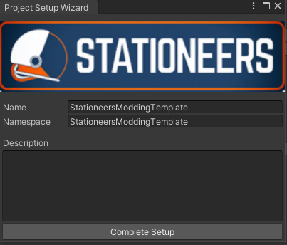

# stationeers.modding.template

Template project for a Stationeers mod.

## Instructions

Clone this project or download as a zip. The project root folder will be used as
the product name, but you can change that during the project setup. 

a Wizard will guide you to perform the basic setup for the project.

This process will create:
 
  - About/ content, including about.xml, preview.png and thumb.png.
  - Scripts/ content, with the main Mod entry point, that will register the 
  prefabs in the game
  - A default Assembly definition to correctly make use of the stationeers dlls.

